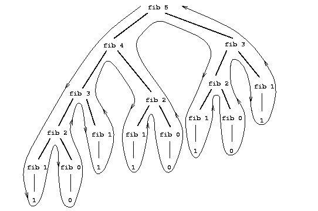

# SICP
### 1.1 程序设计的基本元素

#### 1.1.1 表达式

表达式：你可以键入的基本表达式就是数字，操作符号也是表达式。

`也就是说除了基本表达式还有其他的表达式，用Java来讲，就是对象！`

过程：过程就是 执行诸如 `+ -  * /`这样的操作。可以用表示 基本过程 的表达形式`(例如+或者*)`，将表示数的表达式组合起来，形成复合表达式。这样的表达式称为组合式。

`同理还有非基本过程`

#### 1.1.3 组合式的求值

本章的目标是**要把与过程性思维有关的各种问题隔离出来**

- 求一个组合式，要做下面的事

1. 求该组合式的各个子表达式的值

   ```lisp
   (* 2 4)
   ; 该组合式各子表达式的值为
   *
   2
   4
   ```

2. 将作为最左子表达式的值得那个过程 应用于相应的实际参数，所谓实际参数也就是其他子表达式的值

   `对值进行操作，具体什么操作取决于最左子表达式的过程`

第一个步骤遇到的不是组合式，而是基本表达式，例如数、内部运算符或者其他名字。处理这些基础情况的方式如下规定：

- 数的值就是它们所表示的数值
- 内部运算符的值就是能完成相应操作的计算指令序列
- 其他名字的值就是在环境中关联于这一名字的那个对象

对于初学者，环境所扮演的角色就是用于确定表达式中各个符号的意义。

我们可以把第二种规定看作是第三种规定的特殊情况，为此只需将像 `+` 和 `*` 一类的运算符也包含在全局环境里，并将相应的指令序列作为与之关联的"值"。

`环境就是用来存储变量的地址，并且是含有名字和值这样的键值对`

对于`(define x 3)`的求值并不是将`define`作用于它的两个实际参数，`define`的作用就是为`x`关联一个值，也就是说`(define x 3)`并不是一个组合式。


#### 1.1.7 实例：采用牛顿法求平方根

书中的`good-enough?`做法

```lisp
;
(define (sqrt-iter guess x)
  (if (good-enough? guess  x)
      guess
      (sqrt-iter (improve guess x)
                 x)))

; y方 = x
; 这里的good-enough? 的 x 是一个固定的值 而guess 是一个变化的值
; 每次将变化的guess的平方于固定的x进行差值比较
 (define (good-enough? guess x)
   (< (abs (- (square guess) x)) 0.001))


(define (square x)
  (* x x))

(define (improve guess x)
  (average guess (/ x guess)))

(define (average x y)
  (/ (+ x y) 2))

(define (sqrt x)
  (sqrt-iter 1.0 x))

(sqrt 2)
```

练习`1.7`的`good-enough?`

```lisp

; 传入的参数是平均值 而不是 x 因为x是固定的值 这里的good-enough? 需要做的是对改变的值得比较
(define (sqrt-iter guess x)
  (if (good-enough? guess (improve guess x))
     (improve guess x)
      (sqrt-iter (improve guess x) x)))
; 这里的oldVal 和 newVal 都是变化的值
; oldVal 是不够好之后 改进的值 而 newVal是提前优化的值
(define (good-enough? oldVal newVal)
  (< (/ (abs (- newVal oldVal)) oldVal) 0.01))

(define (improve guess x)
  (average guess x))

(define (average guess x)
  (/ (+ guess (/ x guess)) 2))

(define (square x)
  (* x x))

(define (sqrt x)
  (sqrt-iter 1.0 x))

(sqrt 2)
```

#### 1.1.8 过程作为黑盒抽象


`sqrt`程序可以看作一族过程，它们直接反映了从原问题到子问题的分解

这一分解的重要性并不仅仅在于它将一个问题分解成了几部分，这里最关键的问题是，分解中的每一个过程完成了一件可以清楚表明的工作，这使它们可以被用作定义其他过程的模块。我们无需关注这个过程是如何计算出它的结果的，只需要注意它能做什么。如果只看`good-enough?`过程，与其说`square`是一个过程，不如说它是一个过程的抽象，即所谓的`过程抽象`。在这一抽象层次上，任何能计算出平方的过程都同样可以使用。

`我们不关心方法具体如何实现，只关心方法可以做什么`

### 1.2 过程及其产生的计算

#### 1.2.1 线性的递归和迭代

阶乘的方式有很多种，一种最简单方式就是利用下述认识: 

对于一个正整数`n`，`n!`就等于`n*( n-1)!`

##### 递归过程

当我们说一个过程是递归的时候，论述的是一个语法形式上的事实，说明这个过程的定义中（直接或者间接地）引用了该过程本身

`方法F中调用了自己就说该方法是递归过程`

##### 递归计算过程

在说某一计算过程具有某种模式时（例如，线性递归），我们说的是这一计算过程的进展方式， 而不是相应过程书写上的语法形式

`某个过程含有某种模式比如说线性递归，比如要计算Fib(6)就得计算Fib(5)和Fib(4)，以此类推`



```lisp
(define (plus a b)
  (if (= a 0)
      b
      (inc (plus (dec a) b))))
#| 计算过程如下：
(plus 4 5)
(inc (plus 3 5))
(inc (inc (plus 2 5)))
(inc (inc (inc (plus 1 5))))
(inc (inc (inc (inc (plus 0 5)))))
(inc (inc (inc (inc 5))))
(inc (inc (inc 6)))
(inc (inc 7))
(inc 8)
(9)
这是一个递归计算过程
|#
```

#### 1.2.2 树形递归

##### 实例：换零钱方式的统计

有以下问题：

有`50`美分、`25`美分、`10`美分、`5`美分和`1`美分的硬币，将`1`美元换成零钱，一共有多少种换法

将该问题规约为两个子问题：

- 将总金额`amout`换成除了第一种硬币之外其他硬币的所有方式，加上

  `意思就是比如给20美分，除了第一种硬币50美分外，其他硬币一共有几种换20美分的方法`

- 将总金额 `amout减d` 换成所有硬币的所有方式，`d`是第一种硬币的面值

  意思就是用 `amout-d`后，所有硬币一共有几种能和 `amout-d` 换的方法

终止条件如下：

1. `amout = 0`时，说明已经成功将现金换完，算是一种有效换法

2. `amout < 0`时，说明当前的现金比要兑换硬币面值小，不是有效换法

3. `n = 0`时，说明当前的现金无法兑换硬币了，不是有效换法。

   `n是硬币有几种类型`

我们只需要将上面的描述翻译为一个递归过程：

```lisp
(define (kind n)
  (cond ((= n 1) 1)
        ((= n 2) 5)
        ((= n 3) 10)
        ((= n 4) 25)
        ((= n 5) 50)))

(define (count-change amount)
  (cc amount 5))

(define (cc amount n)
  (cond ((= amount 0) 1)
      ((or (< amount 0)(= n 0)) 0)
      (else (+ (cc amount (- n 1))
               (cc (- amount (kind n)) n)))))
```

##### 帕斯卡三角形

采用递归求某行某列的元素有如下公式：

 `(row col) = (row−1 col−1) + (row − 1 col) (row col) = (row − 1 col − 1) + (row − 1  col)` ，

采用迭代求值有如下公式：

`(row col) = row! / col!⋅(row − col)!`

```lisp
(define (factrial n)
  (fac-iter 1 1 n))

(define (fac-iter count product max-counter)
  (if (> count max-counter)
      product
      (fac-iter (+ count 1) (* count product)  max-counter )))

(define (pascal row col)
  (cond  ((or (> col row) (< col 0) (< row 0) )
        (error "invalid value"))
         (else   (/ (factrial row)
     (* (factrial col) (factrial (- row col)))))
))

(pascal 0 0)
```

注意这里是从第`0`个开始的 

